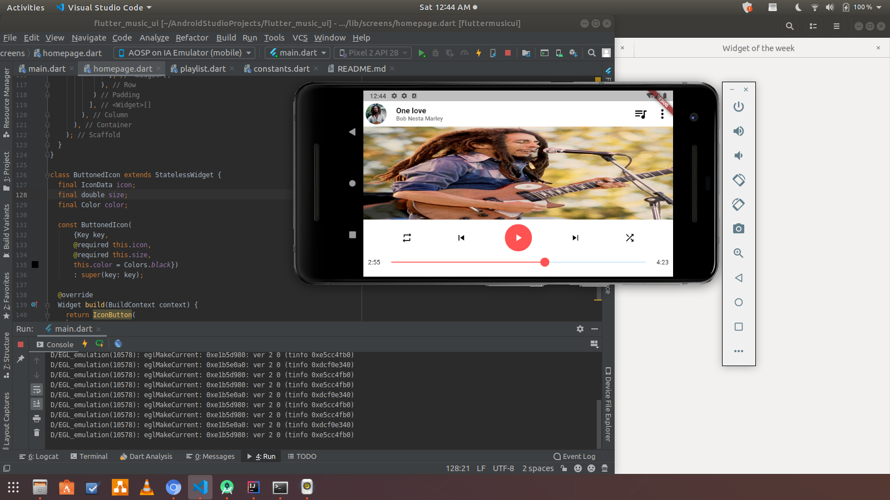
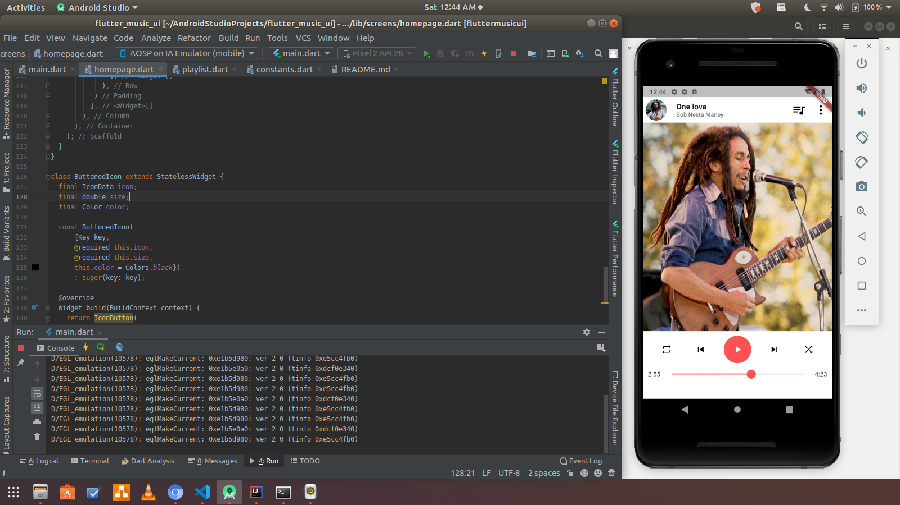

# fluttermusicui

What do you expect from a newbie ?

## ✨ Requirements
* Any Operating System (ie. MacOS X, Linux, Windows)
* Any IDE with Flutter SDK installed (ie. IntelliJ or others)
* A little knowledge of Dart and Flutter
* Object Oriented Programming

## 📸 ScreenShots

